# ConsoleVault - Articolo sui videogiochi

Questa è una pagina di un articolo di ConsoleVault, realizzata con **HTML, CSS e JS`**, sui migliori giochi dell'ultimo decennio (2010-2019). **ConsoleVault è un marchio inventato** con cui ho già realizzato un'app React con un elenco completo di tutte le console Nintendo, Sony e Microsoft mai rilasciate.

---

## Tecnologie e librerie utilizzate:

- **[HTML](https://developer.mozilla.org/en-US/docs/Web/HTML)** - (HyperText Markup Language) per inserire il contenuto della pagina web.

- **[CSS](https://developer.mozilla.org/en-US/docs/Web/CSS)** - (Cascading Style Sheets) per stilizzare la pagina web.

- **[JS](https://developer.mozilla.org/en-US/docs/Web/JavaScript)** - per applicare comportamenti dinamici alla pagina web.

---

**Struttura del progetto**:

- `./pages`: cartella con le pagine secondarie del progetto.
- `./img`: cartella con tutte le immagini utilizzate nel sito web e favicon.
- `./docs`: cartella con tutte le immagini del sito nella versione desktop, mobile oltre a una cartella dedicata alle immagini utilizzate nel README.

 

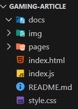

---

### Come avviare il progetto in locale

1. Assicurati di avere Visual Studio Code Installato come IDE con l'estensione Live Server.
2. Clicca in basso a destra nella barra degli strumenti di VSCode per aprire una porta del server e visualizzare il sito sul browser.

3. **Per testare il sito sul tuo dispositivo mobile**, apri il prompt dei comandi (su Windows):

- Start > Cerca > Cmd.
- Scrivere nella console `ipconfig` per ottenere le informazioni sulla configurazione di rete attuale.
- Copiare l'indirizzo IPv4 e strutturare l'indirizzo in questo modo: `IPv4:portaServer/index.html`. La porta del server è del tipo (:5500) o simili.

---

### Il Codice

#### HTML

- Gli screenshots si alterneranno tra light e dark mode. Dark mode implementata tramite l'assegnazione della classe `dark` al body quando si clicca l'icona relativa. Se il tema del dispositivo dell'utente è fià settato sul dark si adatta in automatico.

1. **Intestazione dell'articolo** con titolo e introduzione.

2. **Corpo dell'articolo** con il contenuto principale dell'articolo

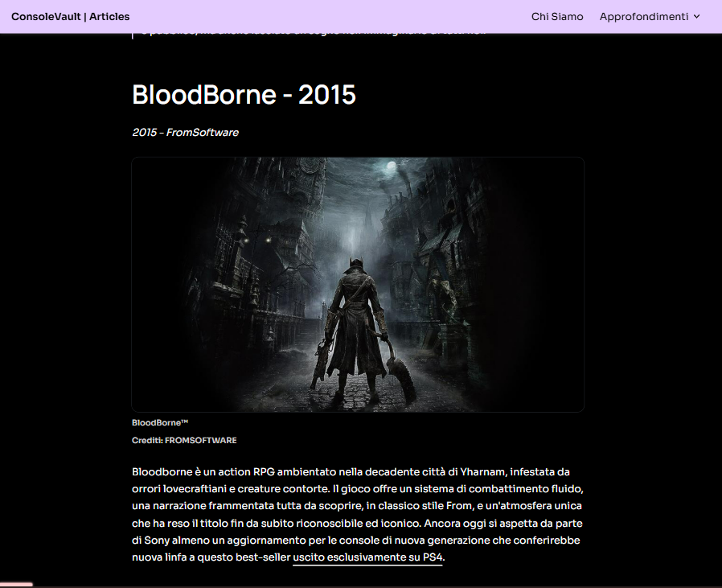

3. **Footer semplice**

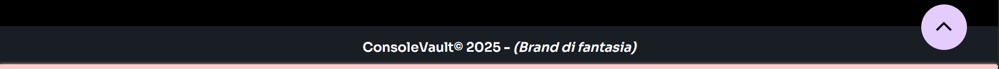

4. **Pagina Informazioni** con alcune informazioni sul marchio.

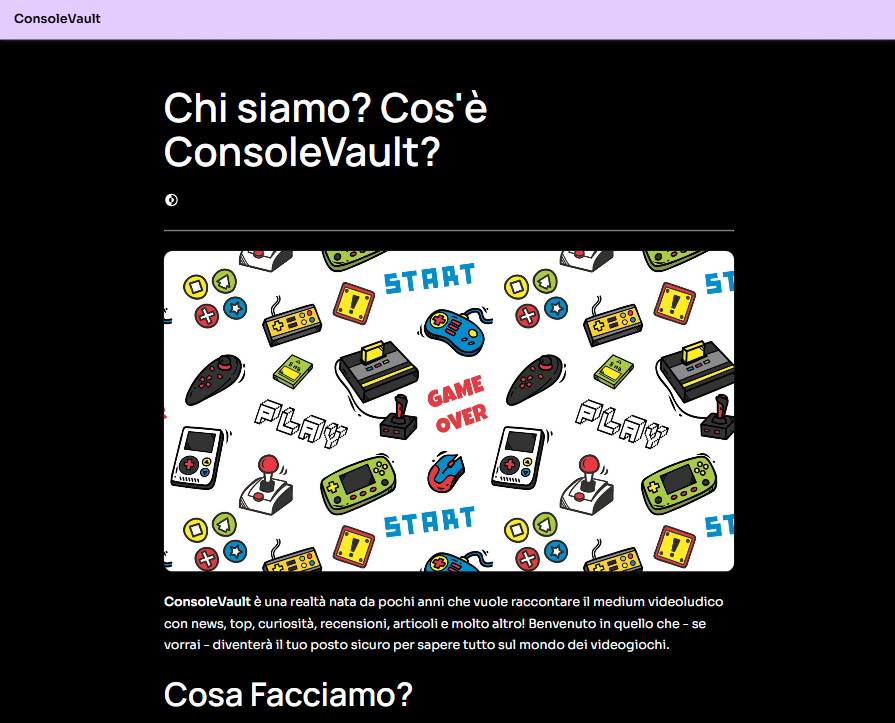

---

#### CSS

- Responsive per dispositivi mobili e desktop con @media
- Approccio mobile first
- Grid e Flex
- Variabili `:root`
- Modalità scura tramite classe `dark al body`
- Bottone per tornare in cima all'articolo quando la progress bar è ad un certo valore:
  - di seguito il codice HTML CSS e JS dello

---

#### JavaScript

- Proprietà **Scroll-padding-top** impostata dinamicamente prendendo l'esatto `offsetHeight` della barra di navigazione

- **Progress bar**:
   

  - HTML - `

`
     

  - `CSS`
    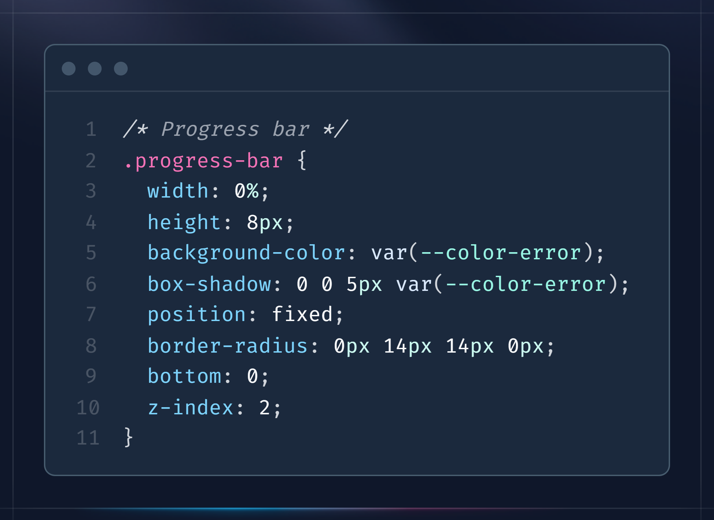
     

  - Infine nel `JavaScript` calcolo l'altezza della pagina, l'altezza dello Scroll dell'utente le divido per 100 e il valore lo associo alla proprietà width della barra.
    
     

- **Pulsante _torna in cima all'articolo_ (backToTop)**: quando il valore `scroll` della Progress bar raggiunge un certo valore, questo pulsante fisso viene visualizzato per facilitare la navigazione nell'articolo.
   

  - Nell'`HTML` viene posizionato dopo il main poco prima del footer
    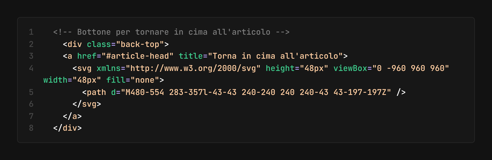
     

  - Nell'`CSS` viene posizionato in position fixed rispetto all'HTML che ha position relative. Stilizziamo anche il bottone con un po' di padding e un colore. Come si può vedere andremo ad iniettare dinamicamente la classe `visible` via JS.
    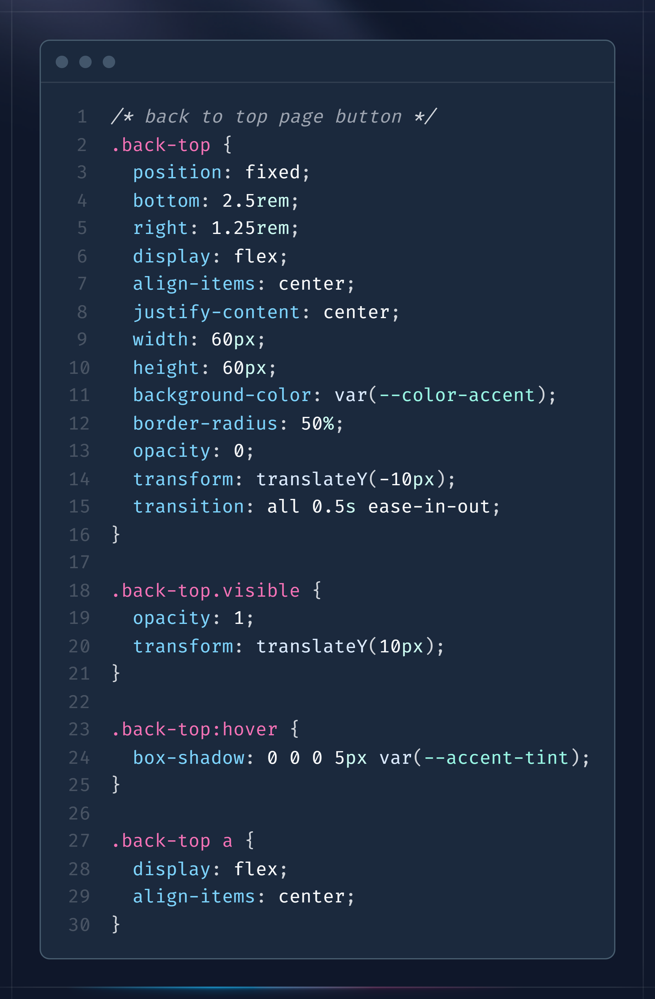
     

  - Nel `JavaScript` tramite dei blocchi if della proprietà `scrolled` della progress bar calcolata, quando essa sarà ad un ceeto valore allora iniettiamo la classe visible per far mostrarlo
    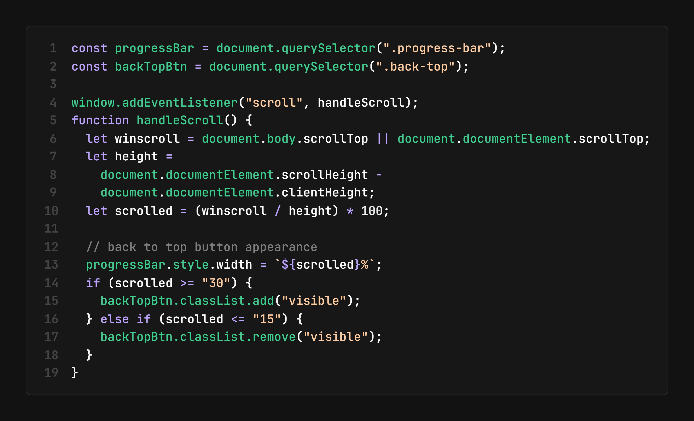
     

- **Lazy Loading** tramite `Intersection Observer`
- Creazione di dati dinamici da un'array di oggetti con le informazioni dei vari giochi per snellire code HTML (maggiori spiegazioni **[nella sezione Note tecniche](#note-tecniche)**).

---

### Note tecniche

- _Questo sito web è stato realizzato a scopo esercitativo_ e alcuni pulsanti o link potrebbero non funzionare (ES: i link del menu a tendina denominato 'approfondimenti' non reindirizzano ad alcuna pagina. Hanno l'attributo `src` impostato su `#`)
- **L'IA ha aiutato** nella creazione della funzione `createGameBodyArticle` che crea un div generico a cui vengono appese tutte le informazioni del gioco in questione prese dall'array di oggetti `gamesData`. Le informazioni vengono appese man mano tramite il metodo `appendChild()`.
   

  - Codice HTML della sezione `article-content` dove andranno generati tutti i contenitori dei singoli div game.
    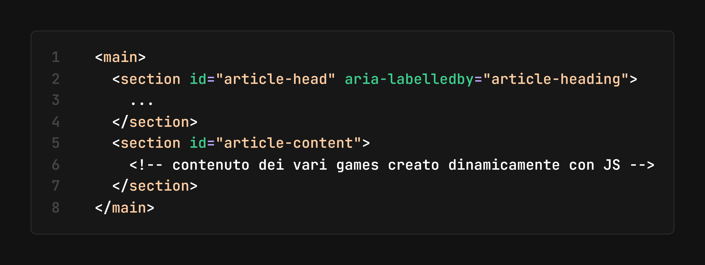

  - Codice JavaScript dell'array di oggetti e della funzione che scorre l'array e genere il contneuto.
    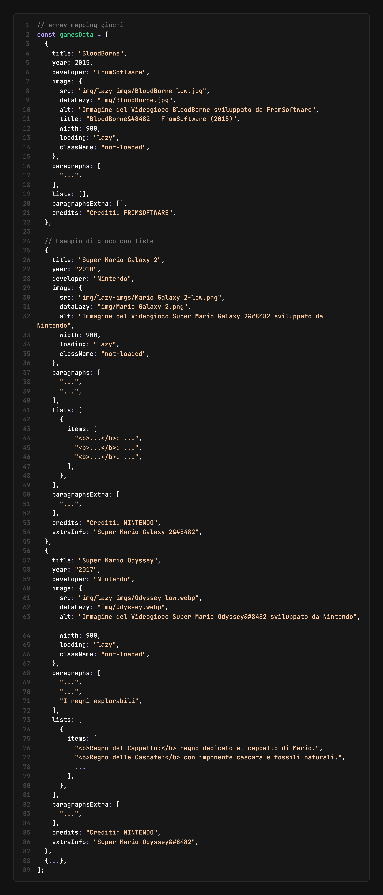
    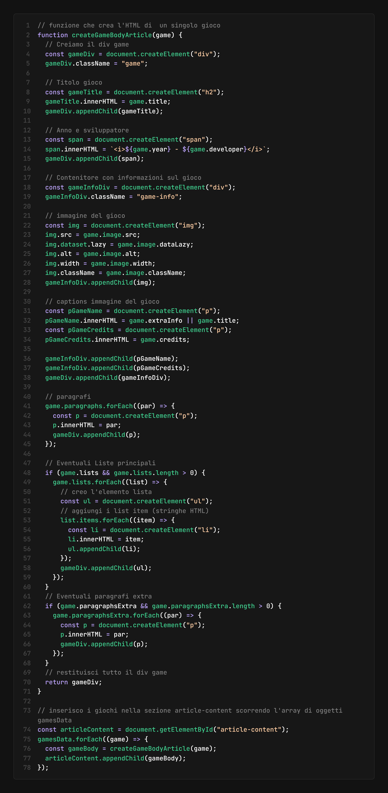

 

- Alcune difficoltà sono state riscontrate con la **creazione del menù dropdown**. Come ho risolto?
   
  **Codice HTML:**
  Ho messo nella `ul` contenente i vari link della `nav`, un div `dropdown` con all'interno il bottone con la freccia, allineati con flex e messi dentro un primo contneitore figlio chiamato `dropdown-button` e poi tutti i link del menù a scomparsa in un altro div `dropdown-content`.
  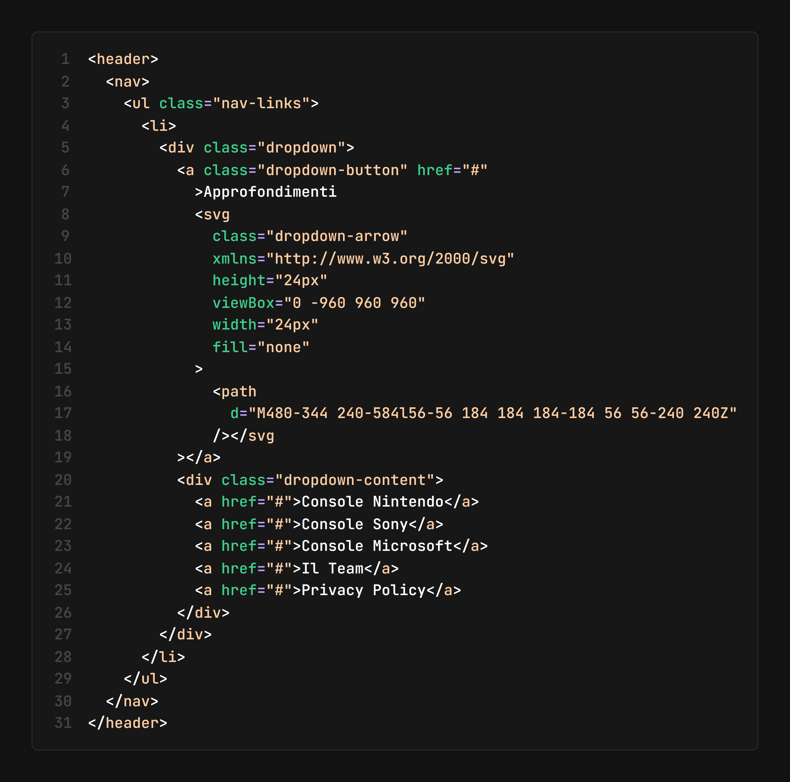
   
  **Codice CSS:**
  Imposto inizialmente il `dropdown-content` con display: none, poi nel JS quando iniettiamo la classe `visible` lo mostro cambiando il valore della proprietà display.
  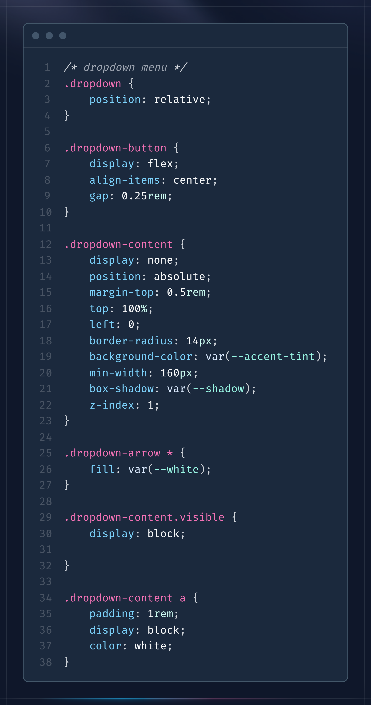
   
  **Codice JS:**
  In questo script seleziono tutti i bottoni o link della nav che sono destinati ad aprire un menu dropdown (con classe `dropdown-button`) e tutti gli elementi di contenuto del menu a tendina (con classe `dropdown-content`) presenti nell'HTML.
   
  Per ciascun bottone (`dropdown-button`) viene aggiunto un Event Listener per il click. Quando un bottone viene cliccato, il codice esegue le seguenti operazioni:

  1. Trova il relativo contenuto del menu (cioè l'elemento `dropdown-content` che si trova subito dopo il bottone - variabile content).
  2. Per ogni elemento di `dropdown-content`, verifica se è quello appena selezionato. **Se è diverso**, rimuove la classe visible (nascondendo il menu). Se è lo stesso, alterna la classe visible per mostrarlo o nasconderlo.

  Questo meccanismo permette di visualizzare un solo menu alla volta e nascondere gli altri quando se ne apre uno.
  
